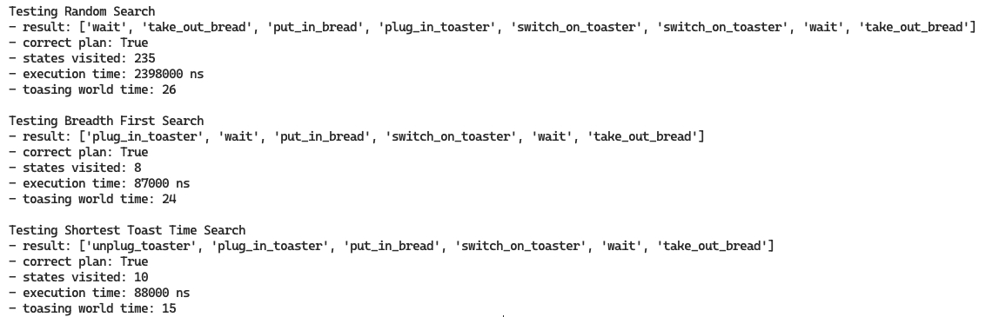
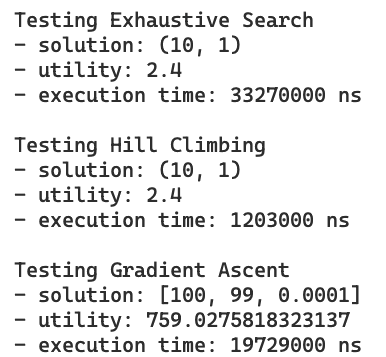

# SE_14 Artificial Intelligence Basics — Assessment Submission

This repository contains my solutions to the practical exercises for the module **SE_14 Artificial Intelligence Basics**. Each subproject covers one area of AI and is accompanied by the algorithm description required by the assessment template.

---

## Repository Structure

```
.
├── README.md                       # This file
├── toast-planning/                 # Problem 1 — Planning
│   └── planning/
│       └── planner.py              # Contains Planner.shortest_toast_time_search
└── toast-optimisation/             # Problem 2 — Optimization
    └── optimization/
        ├── optimization_algorithms.py   # Contains Optimization_Algorithms.gradient_ascent
        └── optimization_problem.py      # Provided utility function
```

Each subproject is self-contained and can be run independently.

---

## Setup

Both projects use only the Python standard library — no additional dependencies are required.

- **Python version:** 3.10 or later recommended

---

## How to Run

### Problem 1 — Shortest Toast Time Search (Planning)

```bash
cd toast-planning
python main.py
```

### Problem 2 — Gradient Ascent for Toast Optimization (Optimization)

```bash
cd toast-optimisation
python main.py
```

---

## Solved Problems

### Shortest Toast Time Search (Homework-Toast)

**Problem Description:** Given a toaster planning problem, the goal is to find the sequence of actions that reaches the goal state (a fully toasted slice of bread) in the minimum total time. Each state holds a `"time"` attribute, and each action carries a time cost based on the difference in `"time"` between the current and successor state.

**Area of AI:** Planning

**Applied Algorithms:** Dijkstra's Algorithm — a uniform-cost search over the state space using a min-heap priority queue. States are always expanded in order of lowest cumulative time from the start, guaranteeing an optimal solution.

**Results:** The algorithm returns the time-optimal action sequence from the start state to the goal, along with the number of states expanded. It outperforms BFS when actions have differing time costs, as BFS only minimises the number of steps, not total time.

<div align="center"></div>

**Location [(Link)](toast-planning/planning/planner.py):** Homework-Toast folder: `Planner.shortest_toast_time_search` in `planner/planner.py`, with helper methods `Planner.get_path_iterative` and `Planner.get_path_recursion` for path reconstruction.

---

### Gradient Ascent for Toast Optimization

**Problem Description:** The task is to maximise the utility of a toast-making process by optimising three parameters: `toast_duration` and `wait_duration` (discrete integers) and `power` (continuous). The challenge lies in combining concepts from hill climbing and gradient ascent to handle a mixed discrete/continuous parameter space, while estimating the gradient numerically without analytical access to the underlying utility function.

**Area of AI:** Optimization

**Applied Algorithms:** Numerical Gradient Ascent — the gradient of the utility function with respect to each parameter is estimated using the central-difference method `(f(x + h) - f(x - h)) / (2h)`. At each iteration, all three parameters are updated simultaneously by stepping in the direction of their estimated slope, scaled by a fixed learning rate. Discrete parameters are rounded only when calling the utility function, allowing the gradient walk to operate on a continuous internal representation. Bounds checking returns a zero gradient at parameter range edges, and values are clamped to stay within the valid range.

**Results:** The algorithm successfully converges towards high-utility parameter configurations across different start states. By tracking the best-seen utility throughout all iterations (rather than only the final state), the algorithm is robust to overshooting near the optimum. Compared to exhaustive search, gradient ascent reaches comparable utility values significantly faster, especially in the continuous `power` dimension where exhaustive search would require fine-grained discretisation.

<div align="center"></div>

**Location [(Link)](toast-optimisation/optimization/optimization_algorithms.py):** `Optimization_Algorithms.gradient_ascent` in `optimization/optimization_algorithms.py`, with the helper method `Optimization_Algorithms.numerical_gradient` for central-difference gradient estimation.

---

## Repository Access

The code base lives in a version control repository. If the repository is private, access has been granted to the module coordinator under the account associated with their official module email by the time of submission.
